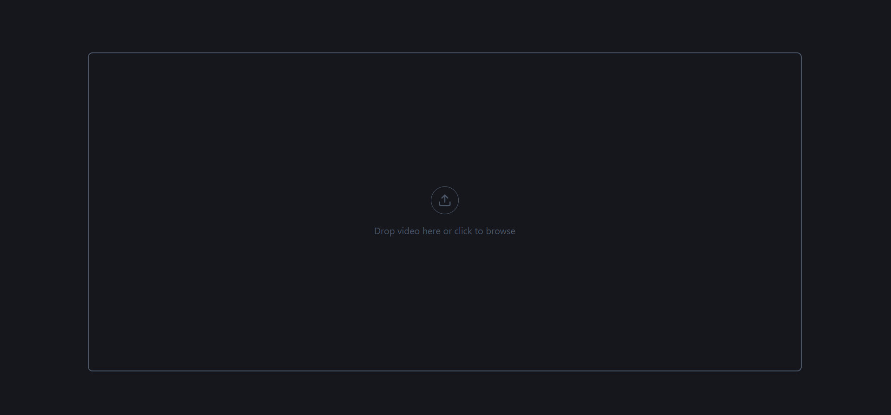
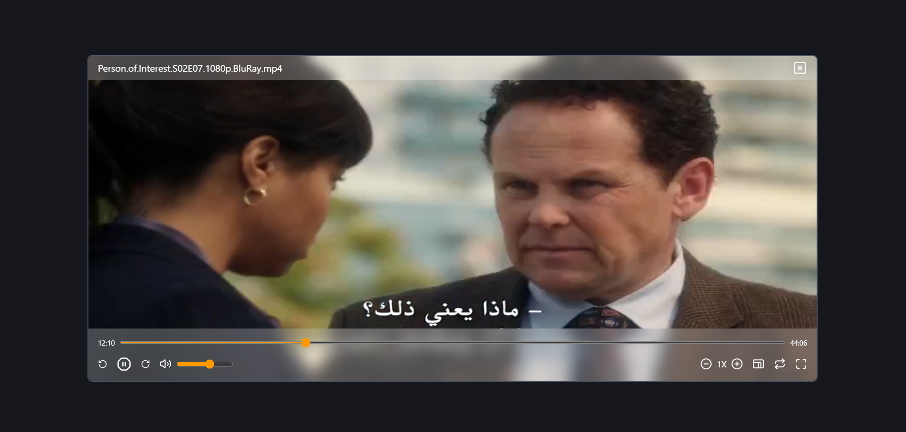

# React Video Player
A modern, customizable video player built with React, focused on performance, accessibility, and clean UI/UX.

## Demo 
- Live Demo:

## Tech-Stack:
- React.js
- State managements using useReducer, useRef, and useState.
- TypeScript.
- TailwindCSS

## Features:
- Select and Remove video.
- Play & Pause video.
- Seek [forward & backward].
- Volume control & mute toggle.
- Playback speed control.
- Loop video toggle.
- Aspect change control.
- Fullscreen mode toggle.
- Progressbar with current time & duration.
- Showcase video info (Eg. name).
- Keyboard shortcuts (Eg. seek, volume, play & pause).
- Reusable and clean component structure.

## Screenshots:

## Challenges & Solutions
   ### Fullscreen handling
   **Problem:** Detecting exit from fullscreen using keyboard (Esc)
   **Solution:** Listening to fullscreenchange event instead of relying only on key events
       
## Future Work:
- Subtitle support.
- Streaming support.

## Installing:
      git clone https://github.com/Ebram-Barsoum/React-Video-Player.git
      cd React-Video-Player
      npm install
      npm run dev
